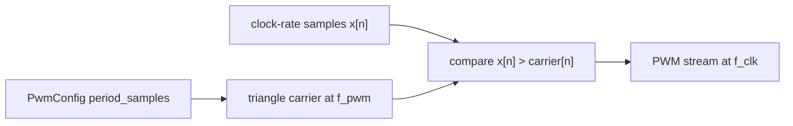
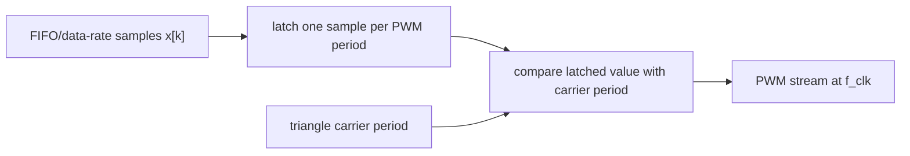
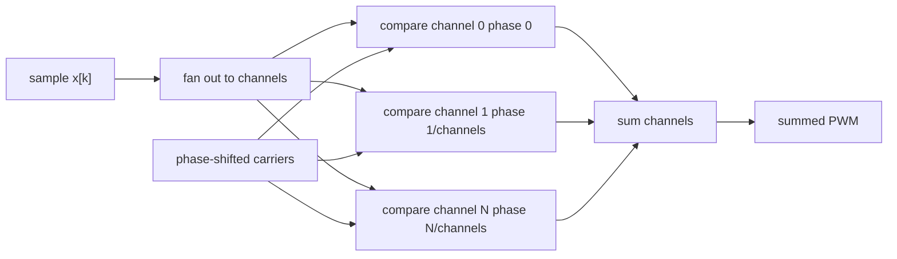
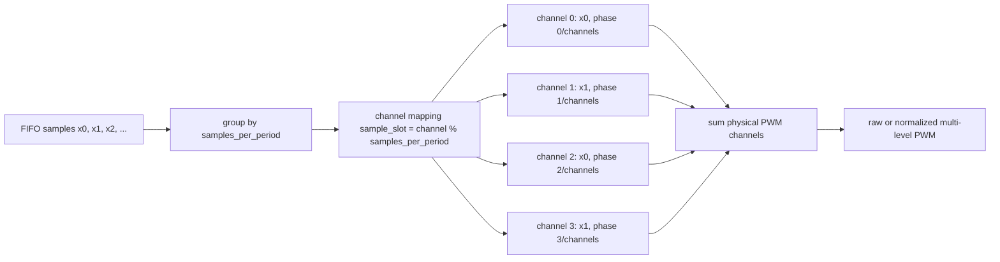
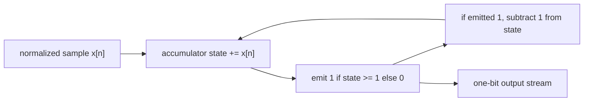
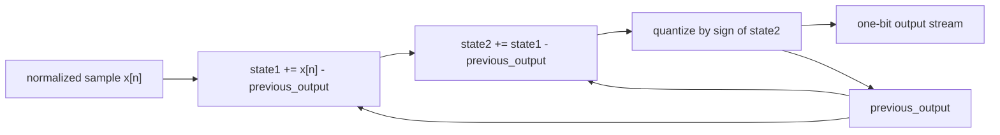
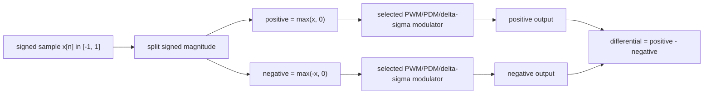

# pwm_lab

`pwm_lab` is a small framework for checking PWM ideas that were previously mixed into `main.ipynb`.
It is intended for fast numerical experiments, not for bit-accurate HDL simulation.

The main use case is comparing PWM kind 1, PWM kind 2, PDM, and one-bit delta-sigma modulation for class-D amplifier studies, including:

- unipolar PWM;
- bipolar PWM with `positive`, `negative`, and `differential` outputs;
- multi-channel PWM with phase-shifted carriers;
- PWM kind 2 with several FIFO samples processed during one PWM period;
- first-order and second-order PDM with unipolar, bipolar, and multi-channel helpers;
- first-order and second-order one-bit delta-sigma with unipolar, signed, bipolar, multi-channel, and FIFO/channel helpers;
- spectra and dominant peak checks;
- sine, LFM, and Lorenz input signals.

## Files

- `signals.py` - input signal generators and normalization helpers.
- `pwm.py` - PWM models and multi-channel variants.
- `pdm.py` - first-order and second-order PDM models and multi-channel variants.
- `delta_sigma.py` - first-order and second-order one-bit delta-sigma models, multi-channel variants, and FIFO/channel strategies.
- `analysis.py` - spectra, peak detection, and simple decimation helpers.
- `experiments.py` - ready scenarios for FIFO-rate, multi-sample PWM kind-2 checks, and PDM/delta-sigma spectra.
- `__init__.py` - public API exported as `from pwm_lab import ...`.
- `plot_pwm_grouped_demo.py` - generates PNG figures for the grouped FIFO PWM strategy.
- `test_pwm.py`, `test_pdm.py`, `test_delta_sigma.py` - lightweight checks without `pytest`.

## Signal Conventions

There are two signal ranges:

- normalized unipolar values: `[0, 1]`;
- signed values: `[-1, 1]`.

Use unipolar signals for ordinary PWM:

```python
from pwm_lab import sine_samples

t, x = sine_samples(freq=20e3, sample_rate=1e6, n_samples=4096)
```

Use signed signals for bipolar PWM:

```python
from pwm_lab import sine_signed

t, x = sine_signed(freq=20e3, sample_rate=1e6, n_samples=4096)
```

Available input families:

```python
from pwm_lab import sine_samples, sine_signed
from pwm_lab import lfm_samples, lfm_signed
from pwm_lab import lorenz_samples
```

## Modulation Block Diagrams

These diagrams show the numerical models implemented in the package. They are
not HDL timing diagrams and do not include power stages, transformers, analog
filters, loads, or dead time.

PWM kind 1 compares a clock-rate input value with the carrier at every clock
sample:



PWM kind 2 latches one FIFO sample for a full PWM period:



Multi-channel PWM sends the same sample to several phase-shifted carriers and
sums the channel outputs:



Grouped FIFO multi-channel PWM reads several consecutive FIFO samples per PWM
period, maps them to physical channels, then sums the channel outputs:



First-order PDM and first-order unipolar delta-sigma use a one-bit accumulator
loop for normalized samples:



Second-order PDM and second-order unipolar delta-sigma use two error-feedback
states and a one-bit quantizer:



Bipolar helpers split a signed input into positive and negative unipolar
branches, run the selected modulator on both branches, then expose the
differential result:



## PWM Configuration

All PWM models use `PwmConfig`:

```python
from pwm_lab import PwmConfig

config = PwmConfig(
    f_clk=100e6,
    f_pwm=200e3,
    resolution_bits=8,
)
```

`config.period_samples` is calculated as:

```text
period_samples = round(f_clk / f_pwm)
```

If the ratio is not an integer, the generated PWM uses the rounded period. Check:

```python
config.actual_f_pwm
config.relative_frequency_error
```

For kind-1 PWM, the input array is interpreted as a clock-rate signal.
For kind-2 PWM, the input array is interpreted as FIFO/data-rate samples that are held for one PWM period.

## Basic PWM

```python
from pwm_lab import pwm_kind1, pwm_kind2_latched

pwm1 = pwm_kind1(samples_at_clk, config)
pwm2 = pwm_kind2_latched(samples_from_fifo, config)
```

Important distinction:

- `pwm_kind1(...)` compares the current input value with the current carrier value.
- `pwm_kind2_latched(...)` holds one input sample for a complete PWM period.

This means PWM kind 2 can change the time scale if FIFO write and PWM read rates are not aligned.

## Basic PDM

PDM does not use `PwmConfig` or a carrier. It emits one `0` or `1` pulse per input sample.

First-order PDM:

```python
from pwm_lab import pdm_first_order

pdm = pdm_first_order(samples)
```

Second-order PDM uses a two-integrator single-bit error-feedback loop:

```python
from pwm_lab import pdm_second_order

pdm2 = pdm_second_order(samples)
```

For a constant input, the average output pulse density approaches the input value:

```python
pdm_first_order([0.25, 0.25, 0.25, 0.25]).mean()
pdm_second_order([0.25, 0.25, 0.25, 0.25]).mean()
```

If the input is sampled at `f_data`, analyze the PDM output with `sample_rate=f_data`.

Bipolar PDM uses the same two-branch convention as bipolar PWM:

```python
from pwm_lab import pdm_first_order_bipolar, pdm_second_order_bipolar

b = pdm_first_order_bipolar(signed_samples)
b2 = pdm_second_order_bipolar(signed_samples)
```

The requirement for bipolar PDM in this framework is:

- input is a signed signal in `[-1, 1]`;
- positive branch density approximates `max(x, 0)`;
- negative branch density approximates `max(-x, 0)`;
- `positive - negative` approximates the original signed signal;
- for `x = 0`, both branches should stay inactive.

Each bipolar result has:

```python
b.positive
b.negative
b.differential
```

Multi-channel PDM runs several staggered accumulators over the same input and sums their outputs:

```python
from pwm_lab import pdm_first_order_multichannel, pdm_second_order_multichannel

y = pdm_first_order_multichannel(samples, channels=4)
y2 = pdm_second_order_multichannel(samples, channels=4)
```

By default, first-order channels use evenly staggered accumulator states. Second-order channels use staggered second-integrator states:

```text
0, 1/channels, 2/channels, ...
```

## Basic Delta-Sigma

One-bit delta-sigma emits one output sample per input sample.
For normalized unipolar values in `[0, 1]`, the output stream uses `0` and `1`:

```python
from pwm_lab import delta_sigma_first_order, delta_sigma_second_order

y = delta_sigma_first_order(samples)
y2 = delta_sigma_second_order(samples)
```

For signed values in `[-1, 1]`, use the direct signed one-bit form:

```python
from pwm_lab import delta_sigma_first_order_signed, delta_sigma_second_order_signed

y_signed = delta_sigma_first_order_signed(signed_samples)
y2_signed = delta_sigma_second_order_signed(signed_samples)
```

The signed stream uses `-1` and `+1`, and its average approaches the signed input value.

Bipolar delta-sigma follows the same two-branch convention as bipolar PWM/PDM:

```python
from pwm_lab import delta_sigma_first_order_bipolar, delta_sigma_second_order_bipolar

b = delta_sigma_first_order_bipolar(signed_samples)
b2 = delta_sigma_second_order_bipolar(signed_samples)
```

Each bipolar result has:

```python
b.positive
b.negative
b.differential
```

Multi-channel delta-sigma uses staggered accumulator states:

```python
from pwm_lab import delta_sigma_first_order_multichannel
from pwm_lab import delta_sigma_first_order_signed_multichannel
from pwm_lab import delta_sigma_second_order_multichannel
from pwm_lab import delta_sigma_second_order_signed_multichannel

y = delta_sigma_first_order_multichannel(samples, channels=4)
y_signed = delta_sigma_first_order_signed_multichannel(signed_samples, channels=4)
y2 = delta_sigma_second_order_multichannel(samples, channels=4)
y2_signed = delta_sigma_second_order_signed_multichannel(signed_samples, channels=4)
```

Delta-sigma FIFO/channel strategies:

```python
from pwm_lab import delta_sigma_first_order_fifo_parallel
from pwm_lab import delta_sigma_first_order_fifo_round_robin
from pwm_lab import delta_sigma_second_order_fifo_parallel
from pwm_lab import delta_sigma_second_order_fifo_round_robin

parallel = delta_sigma_first_order_fifo_parallel(samples_from_fifo, channels=5)
round_robin = delta_sigma_first_order_fifo_round_robin(samples_from_fifo, channels=5)
parallel2 = delta_sigma_second_order_fifo_parallel(samples_from_fifo, channels=5)
round_robin2 = delta_sigma_second_order_fifo_round_robin(samples_from_fifo, channels=5)
```

Interpretation:

- `*_multichannel(...)` sends the same input sample to several staggered channels and sums them;
- `*_fifo_parallel(...)` groups consecutive FIFO samples across channels and emits one summed output per group, so the output sample rate is `input_sample_rate / channels`;
- `*_fifo_round_robin(...)` keeps the original output length and rotates the channel state for each consecutive FIFO sample.

## Bipolar PWM

Bipolar helpers split a signed input into positive and negative branches:

```python
from pwm_lab import pwm_kind1_bipolar, pwm_kind2_bipolar_latched

b1 = pwm_kind1_bipolar(signed_samples_at_clk, config)
b2 = pwm_kind2_bipolar_latched(signed_samples_from_fifo, config)
```

Each bipolar result has:

```python
b1.positive
b1.negative
b1.differential
```

The positive branch is active only for positive input values.
The negative branch is active only for negative input values.

## Multi-Channel PWM

Usual multi-channel PWM uses phase-shifted carriers and the same sample for all channels:

```python
from pwm_lab import pwm_kind1_multichannel, pwm_kind2_multichannel_latched

y1 = pwm_kind1_multichannel(samples_at_clk, config, channels=4)
y2 = pwm_kind2_multichannel_latched(samples_from_fifo, config, channels=4)
```

By default, phases are evenly distributed:

```text
0, 1/channels, 2/channels, ...
```

## PWM Kind 2 With Several FIFO Samples Per Period

This section models PWM kind 2 variants where FIFO samples arrive at a data
rate that can be higher than the PWM update rate.

The basic grouped FIFO idea is:

```text
period 1: channel 1 <- x0, channel 2 <- x1, channel 3 <- x2, ...
period 2: channel 1 <- xN, channel 2 <- xN+1, ...
```

Same-phase carriers:

```python
from pwm_lab import pwm_kind2_same_phase_parallel

y = pwm_kind2_same_phase_parallel(samples_from_fifo, config, channels=5)
```

Phase-shifted carriers:

```python
from pwm_lab import pwm_kind2_phase_interleaved

y = pwm_kind2_phase_interleaved(samples_from_fifo, config, channels=5)
```

### Grouped FIFO Samples Across More Channels

Use `pwm_kind2_fifo_grouped_multichannel(...)` when FIFO read throughput and
the number of summed physical PWM channels are different design choices:

```python
from pwm_lab import pwm_kind2_fifo_grouped_multichannel

y = pwm_kind2_fifo_grouped_multichannel(
    samples_from_fifo,
    config,
    samples_per_period=2,
    channels=4,
)
```

The key parameters are:

```text
samples_per_period   how many consecutive FIFO samples are read per PWM period
channels             how many physical PWM channels are summed
```

The FIFO read rate is:

```text
fifo_read_rate = samples_per_period * config.actual_f_pwm
```

The number of channel copies per FIFO sample is:

```text
channels_per_fifo_sample = channels // samples_per_period
```

The grouped multi-channel mapping is:

```text
period 1: channel 0 <- x0, channel 1 <- x1, channel 2 <- x0, channel 3 <- x1
period 2: channel 0 <- x2, channel 1 <- x3, channel 2 <- x2, channel 3 <- x3
```

In code, the default mapping is:

```text
sample_slot(channel) = channel % samples_per_period
phase(channel)       = channel / channels
```

`channels` must be an integer multiple of `samples_per_period`, so each FIFO
sample in the group gets the same number of physical channels.

By default, physical channel phases are evenly distributed. Pass explicit
`phase_offsets` to model another channel phase plan. For example, all-zero
offsets model same-phase summing:

```python
import numpy as np

y = pwm_kind2_fifo_grouped_multichannel(
    samples_from_fifo,
    config,
    samples_per_period=2,
    channels=4,
    phase_offsets=np.zeros(4),
)
```

`normalize_sum=False` returns the raw summed multi-level PWM values from
`0` to `channels`. The default normalizes the summed output by `channels`.

The output length is:

```text
floor(len(samples_from_fifo) / samples_per_period) * config.period_samples
```

Any incomplete tail group is ignored, matching the other grouped FIFO helpers.
The function models only numerical summing of PWM channel outputs. It does not
model a transformer, analog filter, load, dead time, gate driver timing, or
hardware FIFO timing.

Generate visualization figures:

```powershell
python plot_pwm_grouped_demo.py
```

This creates:

```text
figures/pwm_grouped_mapping.png
figures/pwm_grouped_waveform.png
figures/pwm_grouped_time_realization.png
figures/pwm_grouped_spectrum.png
```

The figures show only the numerical channel summing model. They do not model a
transformer, analog filter, or demodulator.

Useful visualization options:

```powershell
python plot_pwm_grouped_demo.py --samples-per-period 2 --channels 4
python plot_pwm_grouped_demo.py --samples-per-period 4 --channels 8 --groups 12
python plot_pwm_grouped_demo.py --output-dir figures/demo --period-samples 128
```

The mapping figure shows which FIFO sample drives each physical PWM channel.
The waveform figure shows input samples, raw summed PWM levels, normalized
summed PWM, and PWM-period averages.

The time realization figure shows individual physical PWM channels, their raw
sum, and the normalized summed waveform against the FIFO group average.

The spectrum figure has two parts:

```text
low-frequency envelope spectrum
summed PWM spectrum
```

Frequencies are normalized to `f_pwm`. The low-frequency panel compares the
FIFO group-average spectrum with the average of the generated PWM periods. The
summed PWM panel shows the spectral content of the normalized multi-level PWM
before any external filtering.

Interpretation:

- same-phase parallel channels read several FIFO samples during one PWM period and combine them;
- this is a grouped processing / simple decimation model;
- it does not replay every input sample as a separate time instant;
- it is acceptable only when bandwidth and decimation effects are understood;
- phase-shifted carriers change the high-frequency ripple structure, but this model is still a summed multi-channel PWM model.
- grouped multi-channel PWM separates FIFO read throughput (`samples_per_period * f_pwm`) from the number of summed physical channels.

For `f_data = 1 MHz` and `f_pwm = 200 kHz`, at least five channels are needed to read FIFO data without backlog:

```python
from pwm_lab import plan_fifo_rates

plan = plan_fifo_rates(f_data=1e6, f_pwm=200e3, channels=5)
print(plan.min_channels_without_decimation)
```

## Spectra

Single waveform:

```python
from pwm_lab import spectrum_result

spec = spectrum_result("pwm2", y, sample_rate=config.f_clk)
print(spec.peaks)
```

Several waveforms:

```python
from pwm_lab import spectra_for_waveforms

spectra = spectra_for_waveforms(
    {
        "kind1": pwm1,
        "kind2": pwm2,
        "bipolar": b1,
    },
    sample_rate=config.f_clk,
    peak_count=5,
    f_min=1.0,
)
```

Bipolar outputs are expanded automatically:

```text
bipolar.positive
bipolar.negative
bipolar.differential
```

PDM spectra can be computed for first-order and second-order outputs together:

```python
from pwm_lab import pdm_spectra_for_samples

spectra = pdm_spectra_for_samples(
    samples,
    sample_rate=f_data,
    peak_count=5,
    f_min=1.0,
)
```

For bipolar PDM:

```python
spectra = pdm_spectra_for_samples(
    signed_samples,
    sample_rate=f_data,
    bipolar=True,
)
```

For PDM, `sample_rate` is the PDM input/output data rate. Do not use `config.f_clk` unless the PDM stream is actually produced at that clock rate.

Delta-sigma spectra use the same convention:

```python
from pwm_lab import delta_sigma_spectra_for_samples

spectra = delta_sigma_spectra_for_samples(
    samples,
    sample_rate=f_data,
    orders=(1, 2),
    peak_count=5,
    f_min=1.0,
)
```

For direct signed delta-sigma:

```python
spectra = delta_sigma_spectra_for_samples(
    signed_samples,
    sample_rate=f_data,
    signed=True,
)
```

For bipolar delta-sigma:

```python
spectra = delta_sigma_spectra_for_samples(
    signed_samples,
    sample_rate=f_data,
    bipolar=True,
)
```

For FIFO/channel strategies:

```python
spectra = delta_sigma_spectra_for_samples(
    samples_from_fifo,
    sample_rate=f_data,
    channels=5,
    strategy="fifo_parallel",
)
```

Supported strategies are:

```text
same_input
fifo_parallel
fifo_round_robin
```

For `strategy="fifo_parallel"`, output spectra use `sample_rate / channels`. The optional `input` spectrum still uses the original `sample_rate`.

For delta-sigma, `sample_rate` is the modulator input/output data rate. Do not use `config.f_clk` unless the delta-sigma stream is actually produced at that clock rate.

## Quick Checks

Run the smoke checks:

```powershell
python test_pwm.py
python test_pdm.py
python test_delta_sigma.py
python plot_pwm_grouped_demo.py
python -m compileall analysis.py pwm.py pdm.py delta_sigma.py signals.py experiments.py __init__.py plot_pwm_grouped_demo.py test_pwm.py test_pdm.py test_delta_sigma.py
```

The `simulate_fifo_parallel_idea()` helper should produce this FIFO sanity result:

```text
one_channel         -> about 4 kHz
same_phase          -> about 20 kHz
phase_interleaved   -> about 20 kHz
```

This corresponds to the example where one PWM kind-2 channel stretches a 20 kHz input tone to about 4 kHz, while five parallel channels read enough FIFO samples to keep the useful peak near 20 kHz.

## Current Limitations

- The models are numerical and architectural; they are not HDL timing simulations.
- Large `f_clk / f_pwm` and long signals create large arrays. For long experiments, add chunked generation.
- `pwm_kind1(...)` assumes the input is already sampled at `f_clk`.
- `pwm_kind2_latched(...)` assumes the input is FIFO/data-rate samples.
- PDM and direct delta-sigma helpers emit one output sample per input sample and do not model analog reconstruction.
- Delta-sigma `*_fifo_parallel(...)` helpers intentionally group samples and reduce output length by `channels`.
- The multi-sample PWM kind-2 variants combine several samples per PWM period; use them as a decimation/group-processing model, not as proof that every original sample is preserved in time.
- Spectral peak detection is intentionally simple and intended for quick checks. For publication-quality spectra, windowing, coherent sampling, normalization, and plotting choices should be controlled explicitly.
